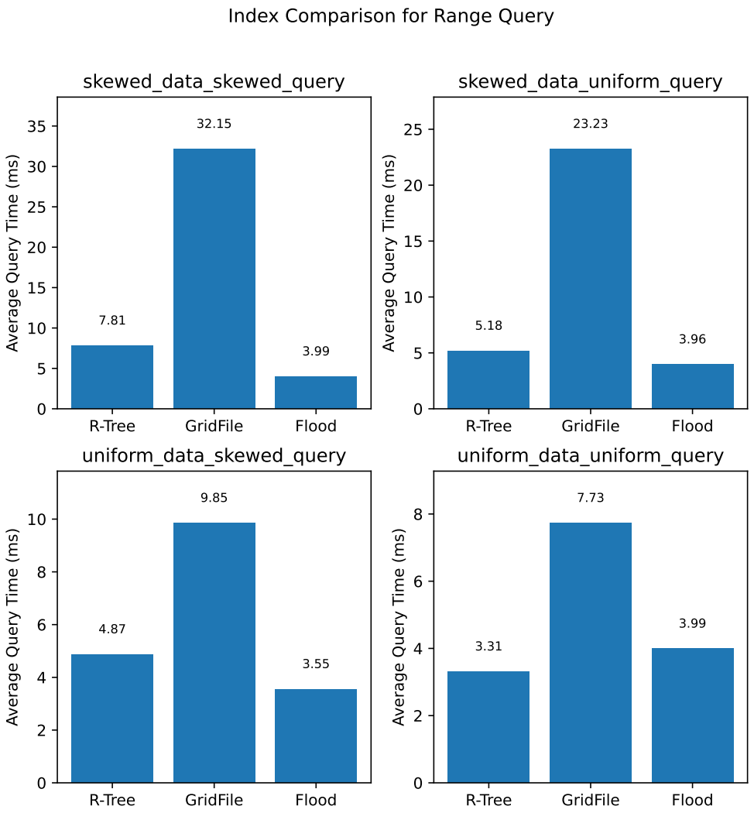

# A Critical Analysis of Flood: A Learned Multi-dimensional Index
Reimplementing Ideas of Flood: A Learned Multi-dimensional Index in C++98

### Background
- Flood is one of the first learned in-memory multidimensional indexes that claims to achieve up to 3x performance improvement for range queries over other multidimensional indexes. https://arxiv.org/pdf/1912.01668.pdf
- **Closed-source**: Because Flood remains a closed-source project, this repository aims to re-implement some of main ideas of the paper to understand, analyze and verify it's range query performance.

### Flood : Recap
Flood is an adaptation of **Grid Files**, and consists of three ideas:
- Optimizing the grid by prioritizing some attributes over others, based on pre-given query workload.
- Transforming Non-uniform data into uniform data
- Defining a sort order for one of the attributes to improve the index performance. 
####  Prerequisites
- Flood index requires both a **dataset** and a **set of query samples** to operate.
- Flood is an automated tool that doesn't require input from a database expert to optimize some hyperparameters such as page size.

### Implementation Details
- This is a single-file header-only implementation that doesn't rely on any third party libraries. Just include the **Flood.h** file in your code. 

### Example
*A complete example is in the examples folder*
```
int dimensions = 3;
int records = 1e7;
int grid_cell_size = 16384;
int dataset_seed = 55;

// Define random dataset in a column-oriented layout.
std::vector<uint32_t> dataset(dimensions*records);

// Fill random dataset with uniform data
using key_type = uint32_t;
std::mt19937 gen(dataset_seed);
uniform_int_distribution<key_type> key_distrib(0, 4e9);
auto rand = [&gen, &key_distrib] { return key_distrib(gen); };
std::generate(dataset.begin(), dataset.end(), rand)

// Define query workload
std::vector<std::vector<uint32_t>> queriesMD;
queriesMD.push_back({ 12341234,3213,1234142 });
queriesMD.push_back({ 100000000,500000000,900000000 });

// Construct flood index
flood::GridFile flood(dimensions, records, grid_cell_size, dataset, queriesMD);

// Define visitor object that will have result set
std::vector<std::vector<uint32_t>> visitor(dimensions);
for (int i = 0; i < visitor.size(); i++)
  visitor[i].resize(records);

// Perform range query
std::cout<< "Total range query matches = " << flood.range_query(dimensions, queriesMD[i], queriesMD[i + 1], visitor) << std::endl;
```

### Experiments
We have performed these experiments on a dataset of size 100m records and 6-dimensions.
In the experiments folder, 4 experiments exist, namely:
- **index_comparison_skew_data_skew_query**: compares range query performance of flood vs r-tree from boost and grid file on skewed dataset and skewed query workload.
- **index_comparison_uniform_data_skew_query.cpp**: compares range query performance of flood vs r-tree from boost and grid file on uniform dataset and skewed query workload.
- **index_comparison_skew_data_uniform_query.cpp**: compares range query performance of flood vs r-tree from boost and grid file on skewed dataset and uniform query workload.
- **index_comparison_uniform_data_uniform_query.cpp**: compares range query performance of flood vs r-tree and grid file from boost on uniform dataset and uniform query workload.


<h3 align="center">
From this figure, we note that Flood index performs better whenever skewness is introduced either in queries or in dataset.
</h3>

### Scripts
- The above figure is generated by running the experiments from the scripts directory.

### Last words
We benchmark the range query performance of our implementation with r*tree from Boost. Unfortunately, most of the baselines used in the paper are closed-source. To the best of our knowledge, R-Tree is one of the rarest open-source, well performing conventional multi-dimensional indexes that supports range queries.